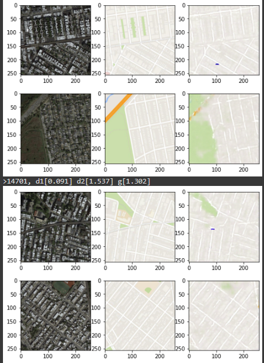

# Paired Image to Image translation Using U-NET generator, custom discriminator - PIX2PIX
Name: Santosh Vasa 
Date: September 25, 2022 
Class: Advanced Perception

### ABSTRACT
Paired Image to Image translation networks can be used for various applications including Image colorizer, Image inpainting, Super resolution, Style transfer and more. Pix2Pix GAN is one of the first GANs to showcase the working on wide range of datasets. This project aims to build the network that is based on the paper: Image-to-Image Translation with Conditional Adversarial Networks, 1611.07004.pdf (arxiv.org) by Phillip Isola et. al. to learn any kind of paired image to image translation. Some of the image enhancement methods such as mentioned above can be implemented using pix2pix paper mentioned in the paper without changing any part of the model configuration. Due to GPU compute constraints, I will be using satellite to maps dataset to showcase the ability of image translation. Satellite to Maps translation is a small dataset and doesn't take a lot of compute for models to converge. Here's the link for the same: Index of /pix2pix/datasets (berkeley.edu). The network uses a generator based on U-Net, a 6-layer CNN as a discriminator, binary cross entropy and mean absolute error as the loss functions. I trained it for 30 epochs on google colab using adam optimizer with [ 100:1] loss weights at a learning rate of 0.0002. 

### INTRODUCTION
Many computer vision problems can be formulated as a image to image translation problem such as face attribute generation, age changing, Image inpainting, Style transfer, Image generation from segmentation map, grayscale to RGB image colorization, super resolution and more. These all problems have been worked independently in the past by using custom training architectures, hyper parameters and loss functions. Pix2pix is a condition adversarial GAN network that aims to solve Image to Image translation problem in general with minimum tweaking required. It converges in datasets such as satellite to maps, drawings to images, cityscapes and more which proves it's ability to generalize in wide range of image to image translation problems. Pix2Pix Gan uses a U-Net architecture for its generator. It originally is made for medical image segmentation that has residual connections between encoder and decoder layers. For a discriminator, a 6 layered convolutional neural network with binary cross entropy is used. To train the generator, mean absolute error and binary cross entropy are used. On Google Colab, I trained the model for 30 epochs using Adam Optimizer with [100:1] loss weights and a learning rate of 0.0002. I used tensorflow as the deep learning framework with TF Records and tf.data for the input pipelines. 

### RELATED WORK
In Image generation tasks, using deconvolution layers, deep learning research initially started with Auto Encoders which showed good performance in Image inpainting , Image colorization and more. Although, these autoencoders and variational autoencoders did not perform well highly complex image outputs and have tend to output soft images. With the introduction of GANs by Ian goodfellow a new area of research of adversarial networks for image generation tasks has begun. GANs outperformed existing networks in generating images and are generative models that can learn large complexity. GANs consists of two networks a generator and a discriminator. These networks are trained in an adversarial fashion with each network having an independent cycle of weight updates. This is designed in order to maintain equilibrium between the networks as the networks are trained to train in an adversarial fashion against each other. This enforces the generator network to stay in the target distribution as well as minimize the mean absolute error. Conditional GANS have then shown us a way in controlling the way the generators output. An input signaling the label info is sent into the latent vector given as input to the generator to control the output. This in our method is instead a image that is used as a condition to output an example in the target space. Using this formulation, Pix2Pix aims to translate any input image space to output image space.

### Operating System Used:
- Windows for Development - Windows 11
- Linux and Colab for Training 

### How to run?
- Install requirements.txt   
` pip install -r requirements.txt`
- Add the project folder to the PYTHONPATH: 
`export PYTHONPATH=${PYTHONPATH}:/path_to_project_folder`
- Update parameters.yaml with the data location. 
- link to datasets :  
  - http://efrosgans.eecs.berkeley.edu/pix2pix/datasets/
- Run python file train.py  
`python3 train.py`
- Time travel days:
  - 3 days
### RESULTS:

Areas where the network works well:
- Building outlines
- Water bodies
- Grass Outfields

Areas where the network does not work well:
- Roads occluded, Road classification
- Dark green trees mis classified as water
- Soft boundaries

Example: 

